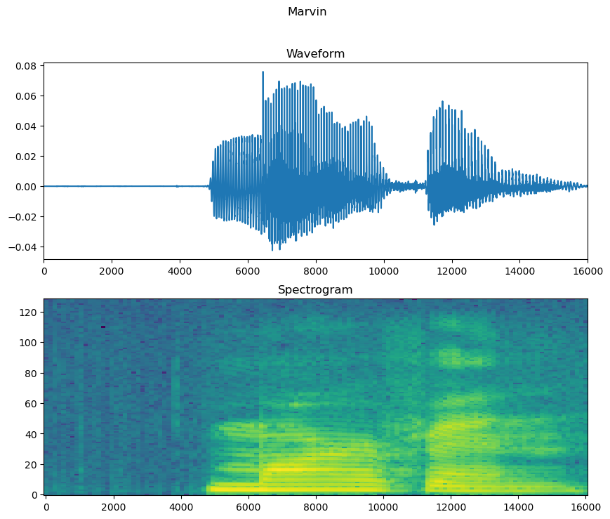

# Limited-Vocabulary-Speech-Command-Recognition

## Dataset
http://download.tensorflow.org/data/speech_commands_v0.01.tar.gz

Reference: https://ai.googleblog.com/2017/08/launching-speech-commands-dataset.html

## Key Features
- **Hybrid Model:** The approach combines Convolutional Neural Networks (CNNs) for spatial feature extraction and Long Short-Term Memory (LSTM) networks for capturing temporal patterns in audio data.
- **Dataset Augmentation:** Data augmentation techniques were employed to enhance the model's ability to generalize to various acoustic conditions and speaking styles. The raw audio files were converted to spectrograms.
- **Evaluation Metrics:** The project provides comprehensive evaluation metrics, including accuracy, precision, recall, and F1-score, to assess the model's performance accurately.

## Methodology
1. **Data Preprocessing:** Audio clips are converted into spectrogram representations to facilitate audio analysis.
2. **CNN Feature Extraction:** CNN layers are employed to learn spatial features from the spectrograms.
3. **LSTM Temporal Modeling:** LSTM layers capture sequential patterns and dependencies in the learned features.
4. **Model Fusion:** The outputs of the CNN and LSTM networks are combined for final predictions.

## Results
Our hybrid CNN-LSTM model demonstrates impressive performance:
- **Test Accuracy:** 92.67%
- **Precision:** 0.93
- **Recall:** 0.91
- **F1-Score:** 0.92

## Usage Instructions
1. Clone this repository using `git clone https://github.com/udayraghuvanshi03/Limited-Vocabulary-Speech-Command-Recognition.git`.
2. Navigate to the project directory: `cd limited-vocabulary-speech-recognition`.
3. Install the required dependencies: `pip install -r requirements.txt`.
4. Have your data stored and set the 'dataset_path'
5. Run the file 'code.py'
